# 88mph-full-on-chain-NFT
On-chain NFT for 88mph Bond token, inspired by Uniswap V3 NFT. NFT's Image is saved on-chain in base64 encoded SVG format.

### Concept
88mph is a DeFi protocol for providing fixed-term fixed-rate interest. It does so by pooling deposits with differing maturations and fixed-rates together and putting the funds in a yield-generating protocol, such as Compound, Aave, and yEarn, to earn floating-rate interest. 

88mph's Bond token is NFT, which users can trade on the markets like OpenSea. There are no URIs registered in the `tokenURI()` of 88mph, and when I saw them in OpenSea, I thought it was a shame. 

`NFTV2` contract inherits 88mph's Bond `NFT` contract. `tokenURI()` returns string which contains the encoded SVG, but the owner can rewrite token uri by calling `setTokenURI()`

[88mph app](https://88mph.app)  

[88mph Github](https://github.com/88mphapp/88mph-contracts) 

### SVG

## Setup
To install dependencies,run  
`yarn`

## Compile

`yarn build`

## Test

`yarn test`

Also,This generates a image in SVG format in `images` folder